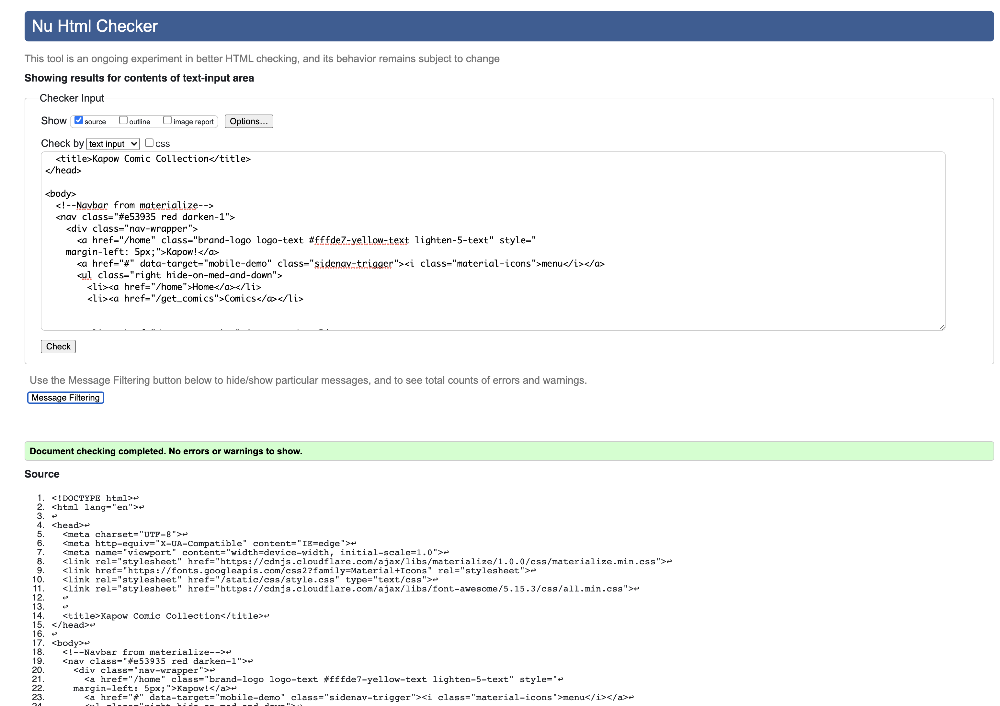
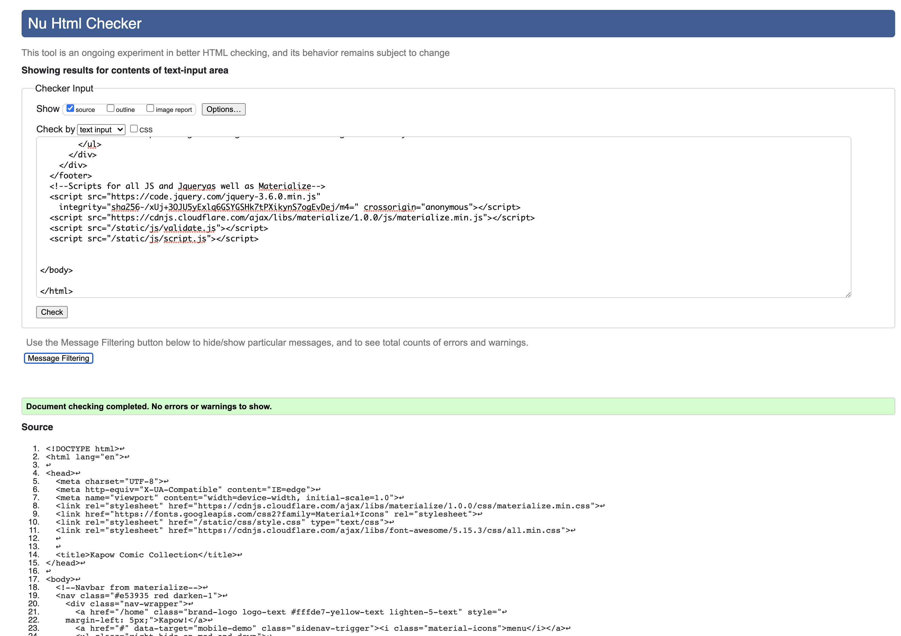
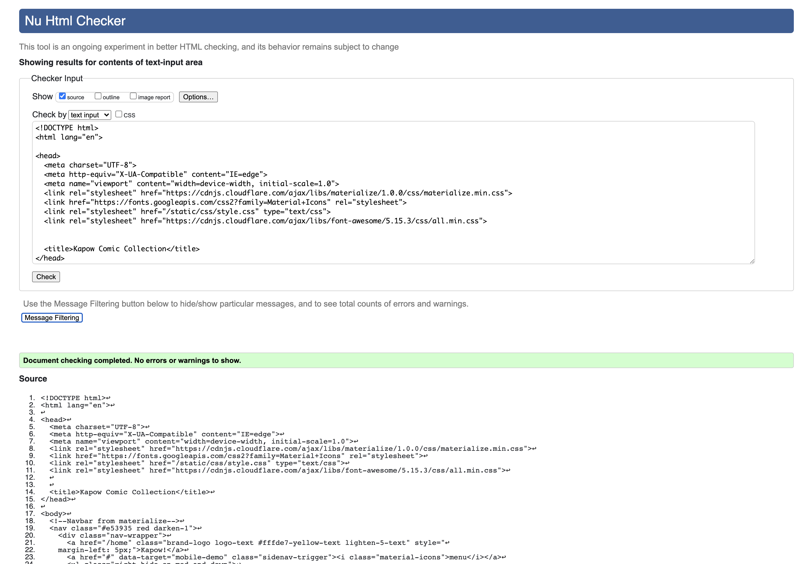
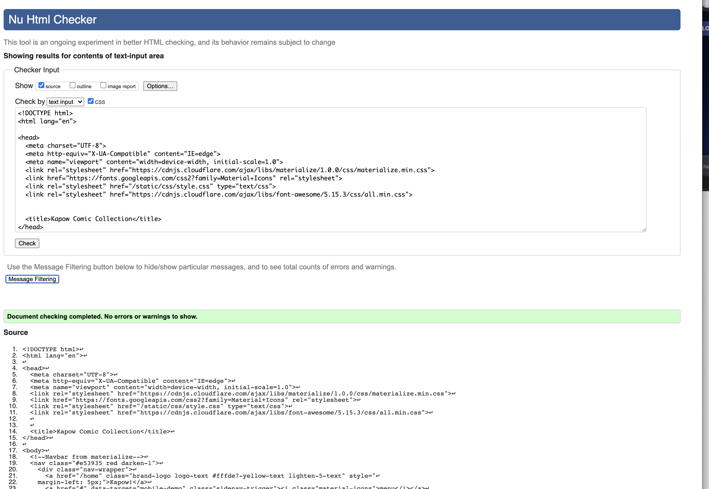
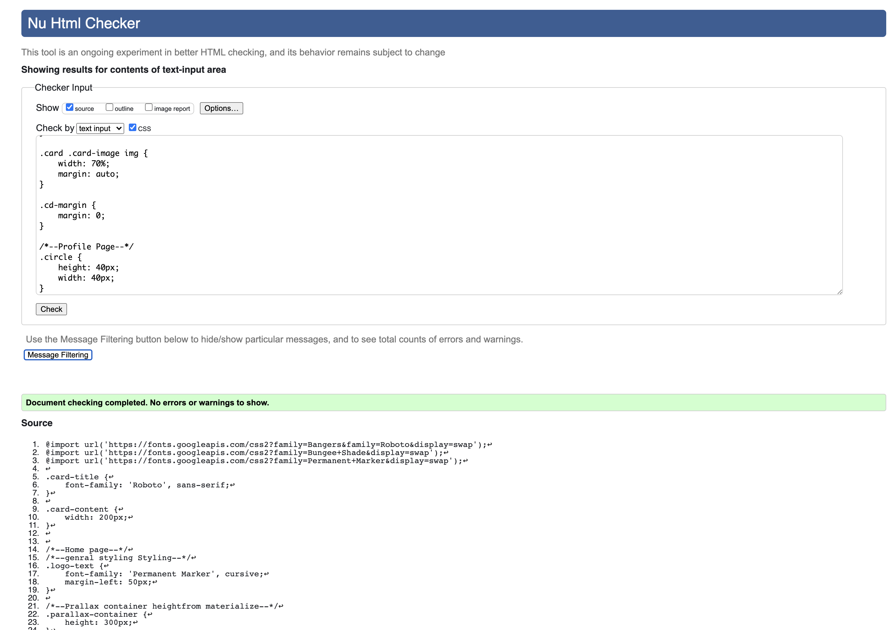
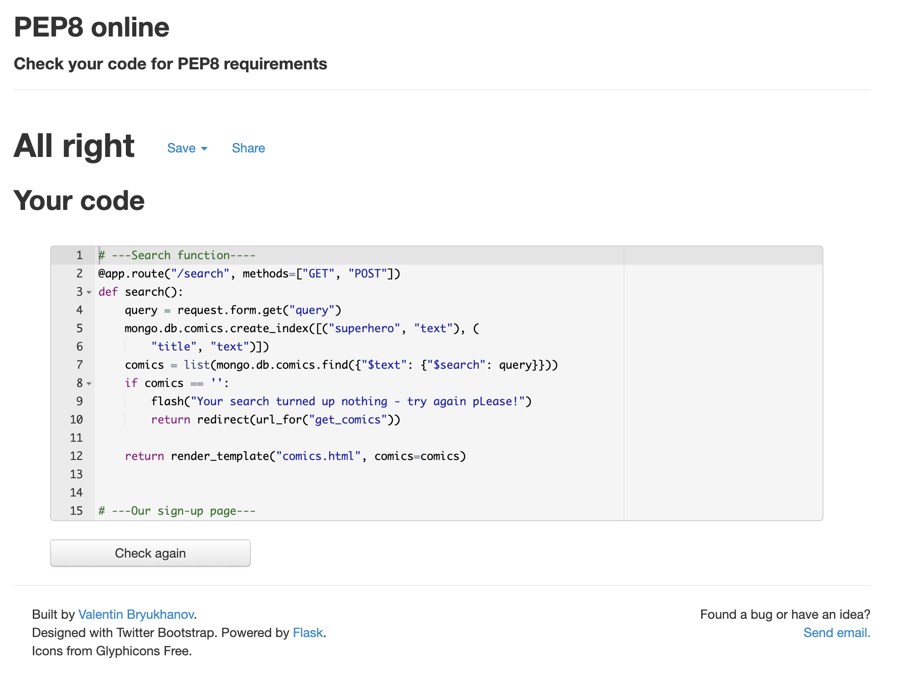

#  Testing Ground
## Overview 
As this was a data driven project much of the testing was done using friends to check the performances of the app. In the beginning the regex was too stringfent and users were unable to "easily" sign-up. 
#
## Validators used: 
- The W3C Markup Validator and W3C CSS Validator Services were used to validate every page of the project to ensure there were no syntax errors in the project. PEP-8 was used for the python code.

-   [W3C Markup Validator](https://jigsaw.w3.org/css-validator/#validate_by_input)
-   [W3C CSS Validator](https://jigsaw.w3.org/css-validator/#validate_by_input) 
-   [PEP 8](http://pep8online.com/) 

### Proof of final validation:

### HTML:
#### home.html 

#### comics.html 

#### profile.html 

#### add_comic.html 

#### signup.html 

#### signin.html 

### CSS:
#### style.css

### PEP 8 Compliant:
#### PEP-8
-  The PEP-8 online validator was used to check my python code and it proved fine. 

## Responsiveness

For the responsiveness I used Chrome Developer Tools to check how the website would behave. However saying this I must add that it did not always give a correct or real account on the device. Of course it is only a tool and not but I found one instance where it did not give me the correct response. This was an instance it was for mobile phone (iPhone X). On Dev tools it showed the main figure on the front-page was clearly visible but when I uploaded this on my device his head appeared cut-off by the jumbotron. The image looked too big. I did clear this up later by adding a media query and viewpoint height.  
For the responsiveness I used Chrome Developer Tools to check how the website would behave. However saying this I must add that it did not always give a correct or real account on the device. Of course it is only a tool and not but I found one instance where it did not give me the correct response. This was an instance it was for mobile phone (iPhone X). Unfortunately I had some issues with the response for the time and weather icons

I also used [Responsive Design Checker](www.responsivedesignchecker.com) and this was fairly accurate. The difference (niether good nor bad) this site has over Chrome Devoloper is that it has some sizes that Chrome does not such as the IMac Desktop 24". I us the 27" so when I opened my browser to Chrome it overstretched my image. Below is a responsiveness chart that shows the how each device responded. I added the surface duo because it has a perculiar screen so i can see how my site reacts. 

### Further Testing

-   The Website was tested on Google Chrome, Internet Explorer, Microsoft Edge and Safari browsers.
-   The website was viewed on a variety of devices such as Desktop, Laptop, iPhone7, iPhone 8 & iPhoneX.
-   A large amount of testing was done to ensure that all pages were linking correctly.
-   Friends and family members were asked to review the site and documentation to point out any bugs and/or user experience issues.

## User stories

 ### User stories

    -   #### First Time User Goals

        1. As a First Time User, I want to easily understand the main purpose of the site and learn more about the concept.
         - There is informtion in the hero text to send you in the right direction and explains the prupose of the site.

        2. As a First Time User, I want to be able to easily navigate throughout the site to find content.
        - The same as above there is guidence in the hero text in the home.html to let you know in which direction to go.

        3. As a First Time User, I would like to sign in easily.
        - I have added REGEX to the sign in and resposive text to let the user know that they are correct.

        4. As a First Time User, I would like to add a new comic if I should wish.
        - Once a user has signed in they can immediately start adding the comic of their choice.

        6. As a First Time User, I would like to tag a new comic if I should wish.
        - First time users can tag a comic by clicking on the star.

    -   #### Returning Visitor Goals

        1. As a Returning User, I want to see sign in with ease so that I can navigate easily.
        - There is direction to sign in and navigate thereafter.

        2. As a Returning User, I would like to remove a new comic if I should wish.
        - This can only be done if the User added the comic himself but it is possible to do this by clicking on the "Goodbye" button.

     -   #### Admin User Goals
        1. As an Admin User, I want to check in my profile to view any new added comics.
        - All comics that are added in the comics pager are automatically downloaded in the admins page so that he has control. 

Backend
-   Was deploying on Heroku but showed an error pymongo Auth fail. I worked out that my MONGO_URI Connection was incorrect.
-   Tried to sign in as "admin" but was thrown an error "UnboundLocalError: local variable 'favorite' referenced before assignment". The reason for this was that the "favorite" value had been assigned to the user but not to the admin. Igor from Tutor support asssisted me with this.
-  Tried to add a flash as defensive design to inform User that the search yielded a no result. On the debugger it returned a "Typeerror ' comics ' not supported between instances of 'list' and 'int' in python. I did some research on Stack overflow and the resolved the issue with a len() method. It proved correct.
- There was no custome 404 showing so looking into the code revealed there was a route error. i had added the incorrect path to the right html directory.

Frontend
- There were many frontend issues and although this is not conclusive, but possibly as a result of Materialize. Most of the time it was the comic card face content- that had shifted 50px to the left but this was fixed using DevTools on Google, testing the change and then applying iy directly into the HTML. 

## Side Notes
